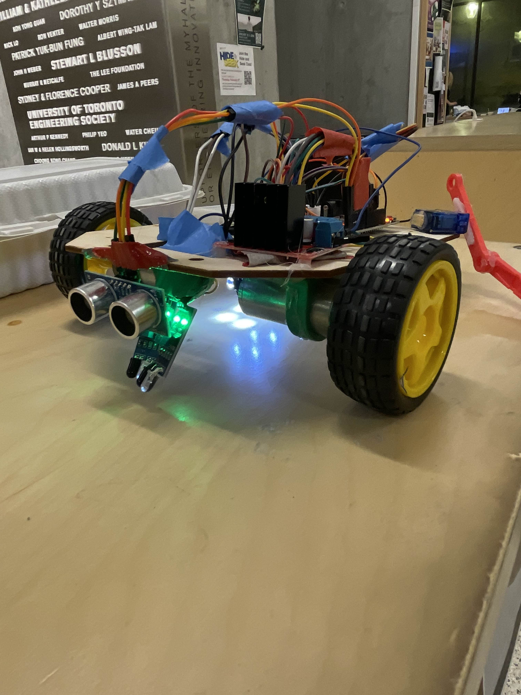
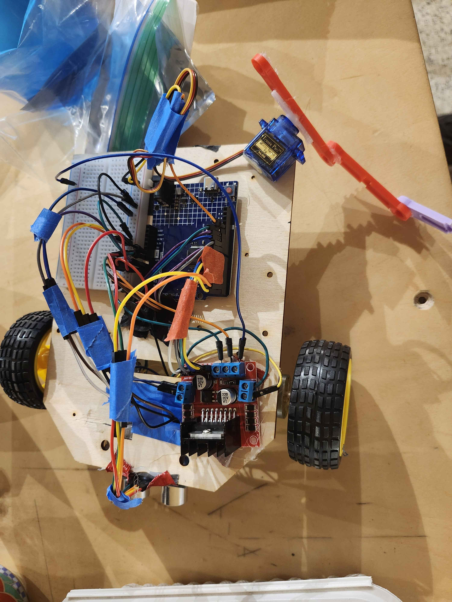
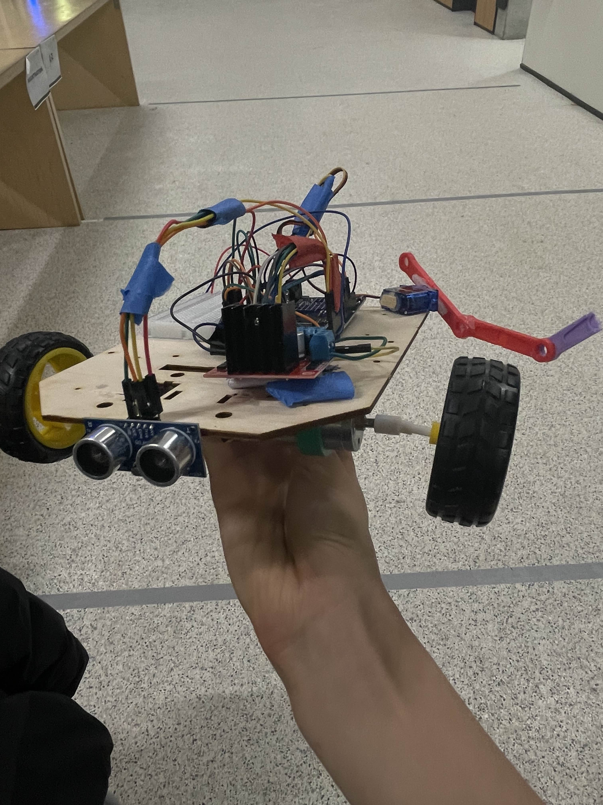

# ROG-G67
Imagine an explosive, fast, and smart car. You don't need to. The ROG G67 specs are 6x more efficient than our competitors, has 7x more aura, and the other 67 reasons you'll find out on the track...

<video src="public/videos/hero-1.mp4" controls width="720"></video>

## Inspiration
Many cars I see on a daily basis are semi-autonomous vehicles, with fully-autonomous and unattended vehicles as a reality in the coming years. Our team was really eager to learn, create and contribute to this evolving field, especially since all of us our interested in becoming future engineers and making an impact.

## What it does
We built both an RC Car MVP and interactive website to showcase our prototype

## How we built it
- We used Arduino IDE that runs on C++ to power the RC Car
- We built the website using React with react-three fibre for our 3D design

## Challenges we ran into
- Our car constantly experienced broken wheels that required us to perform wheel changes
- The claw mechanism we had to DIY because the given items were incompatible

## Accomplishments that we're proud of
- It was many of our first time building any form of autonomous vehicle, and hardware in fact.

## What we learned
- We learned how to use Github Copilot to enhance our code quality and efficiency

## What's next for ROG G67
Implement computer vision for human detection and improve spatial awareness.
